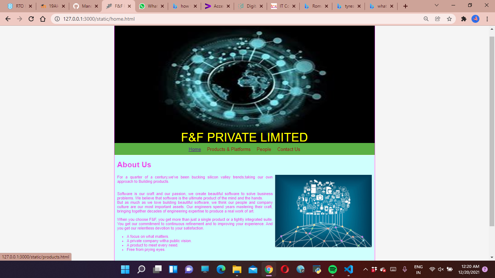
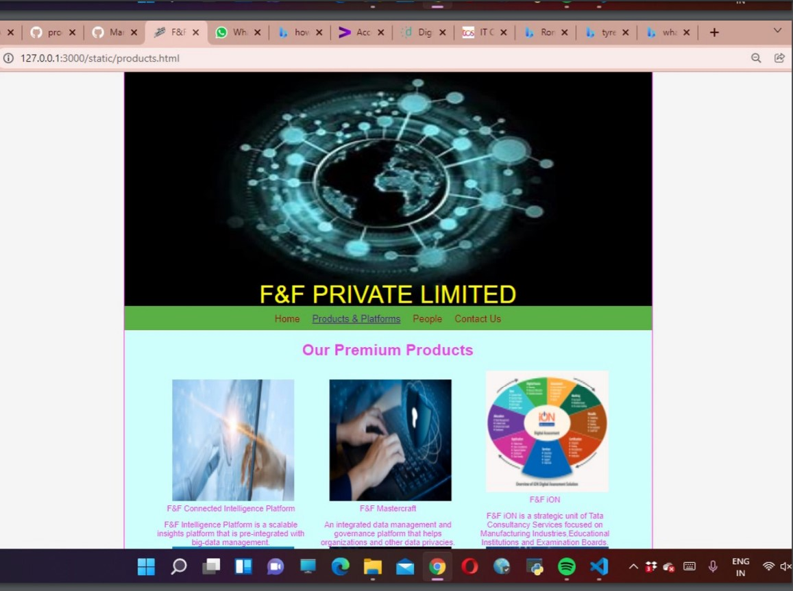
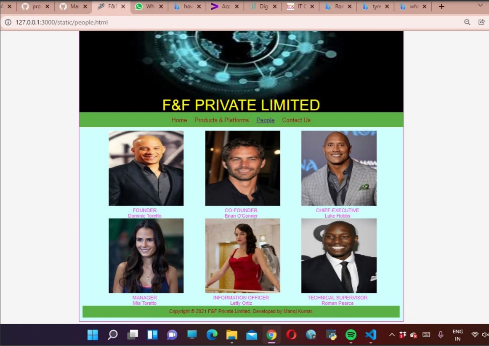

# Web Design for a Software Product Company

## AIM:

To design a static website for a software product company company.

## DESIGN STEPS:

### Step 1:

Requirement collection.

### Step 2:

Creating the layout using HTML and CSS.

### Step 3:

Updating the sample content.

### Step 4:

Choose the appropriate style and color scheme.

### Step 5:

Validate the layout in various browsers.

### Step 6:

Validate the HTML code.

### Step 6:

Publish the website in the given URL.

## PROGRAM :
# Home:
```
<!DOCTYPE html>
<html lang="en">
  <head>
    <title>F&F Private Limited</title>
    <link rel="stylesheet" href="./css/layout.css" />
    <link rel="icon" href="./img/fflogo.jpg" type="image/x-icon" />
  </head>

  <body>
    <div class="container">
      <div class="banner">F&F PRIVATE LIMITED</div>
      <div class="menu">
        <div class="menuitemselected"><a href="/static/home.html">Home</a></div>
        <div class="menuitem"><a href="/static/products.html">Products & Platforms</a></div>
        <div class="menuitem"><a href="/static/people.html">People</a></div>
        <div class="menuitem"><a href="/static/contact.html">Contact Us</a></div>
      </div>
      <div class="content">
        <div class="homecontent">
          <h1>About Us</h1>
          
          <div class="contenttext">
            <p>For a quarter of a century,we've been bucking silicon valley trends,taking our own approach to 
            Building products.</p>
            <br />
            Software is our craft and our passion, we create beautiful software to solve business problems.
            We believe that software is the ultimate product of the mind and the hands.
            <br/>
            But as much as we love building beautiful software, we think our people and company culture are 
            our most important assets. Our engineers spend years mastering their craft, bringing together
            decades of engineering expertise to produce a real work of art.
            <br>
            <p>When you choose F&F, you get more than just a single product or a tightly integrated suite. 
            You get our commitment to continuous refinement and to improving your experience. And you get our 
            relentless devotion to your satisfaction.</br></p>
            <ul>
              <li>A focus on what matters.</li>
              <li>A private company witha public vision.</li>
              <li>A product to meet every need.</li>
              <li> Free from prying eyes.</li>
            </ul>
          </div>
        </div>
      </div>
      <div class="footer">
        Copyright &#169; 2021 F&F Private Limited, Developed by Manoj Kumar.
      </div>
    </div>
  </body>
</html>
```
# Product:
```
<!DOCTYPE html>
<html lang="en">
  <head>
    <title>F&F Private Limited</title>
    <link rel="stylesheet" href="./css/layout.css" />
    <link rel="icon" href="./img/fflogo.jpg" type="image/x-icon" />
  </head>

  <body>
    <div class="container">
      <div class="banner">F&F PRIVATE LIMITED</div>
      <div class="menu">
        <div class="menuitem"><a href="/static/home.html">Home</a></div>
        <div class="menuitemselected"><a href="/static/products.html">Products & Platforms</a></div>
        <div class="menuitem"><a href="/static/people.html">People</a></div>
        <div class="menuitem"><a href="/static/contact.html">Contact Us</a></div>
      </div>
      <div class="content">
        <div class="productcontent">    
          <h1>Our Premium Products</h1>
          <div class="productitems">
              <div class="productitem"> 
                  <div class="itemimage">
                  
                  </div>
                  <div class="itemname">F&F Connected Intelligence Platform</div>
                  <div class="itemname"><p>F&F Intelligence Platform is a scalable insights platform 
                    that is pre-integrated with big-data management.</p></div>
                  
              </div>
              <div class="productitem"> 
                  <div class="itemimage">
                  
                  </div>
                  <div class="itemname">F&F Mastercraft</div>
                  <div class="itemname"><p>An integrated data management and governance platform that helps 
                    organizations and other data privacies.</p></div>
              </div>
              <div class="productitem">
                <div class="itemimage">
                                    
                </div>
                <div class="itemname">F&F iON</div>
                <div class="itemname"><p>F&F iON is a strategic unit of Tata Consultancy Services focused on Manufacturing 
                  Industries,Educational Institutions and Examination Boards. </p></div>
              </div>
              <div class="productitem">
                <div class="itemimage">
                  
                </div>
                <div class="itemname">F&F Optumera</div>
                <div class="itemname"><p>F&F Optumera AI-powered retail optimization suite, helps to optimize 
                  merchandising and supply chain decisions in an integrated manner.</p> </div>
              </div>
              <div class="productitem">
                <div class="itemimage">
                  
                </div>
                <div class="itemname">F&F Chroma</div>
                <div class="itemname"><p>CHROMA is F&F's Talent 4.0 solution helping enterprises to rapidly 
                  adopt HR best practices, foster collaboration, and effectively nurture talent.</p></div>
              </div>
              <div class="productitem">
                <div class="itemimage">
                  
                </div>
                <div class="itemname">F&F Intelligent Urban Exchange</div>  
                <div class="itemname"><p>F&F Intelligent Urban Exchange IoT Analytics for Smart Cities and 
                  Businesses is a modular, insight-centric platform that provides smart software solutions.</p></div>
              </div>
              <div class="productitem">
                  <div class="itemimage">
                    
                  </div>
                  <div class="itemname">F&F Customer Intelligence</div> 
                  <div class="itemname"><p>F&F Customer Intelligence & Insights, 
                    the AI-driven customer analytics software solution turns data into actions so you can deliver personalized.
                     </p></div>
              </div>
              <div class="productitem">
                  <div class="itemimage">
                    
                  </div>
                  <div class="itemname">F&F Omni Store</div>
                  <div class="itemname"><p>F&F OmniStore is a unified commerce platform that completely 
                    revolutionizes the way customers shop and will be at the heart of everything you do.</p></div>
              </div>      
              <div class="productitem">
                  <div class="itemimage">
                    
                  </div>
                  <div class="itemname">F&F Quartz</div>
                  <div class="itemname"><p>Quartz solutions are designed to enable institutional grade, secure 
                    stody, and transaction management for crypto and digital assets.</p></div>
              </div>      
              <div class="productitem">
                  <div class="itemimage">
                    
                  </div>
                  <div class="itemname">F&F ignio</div>
                  <div class="itemname"><p>Transform your operations across domains using AI and Automation 
                    towards an Autonomous Enterprise for improved resilience, assurance.</p></div>
              </div>
              <div class="productitem">
                  <div class="itemimage">
                    
                  </div>
                  <div class="itemname">F&F Accelerate Growth</div>
                  <div class="itemname"><p>Meet your customers where they are;
                    Leverage on partnerships to help to increase reach across devices, channels, and markets.</p></div>
              </div>      
              <div class="productitem">
                  <div class="itemimage">
                    
                  </div>
                  <div class="itemname">F&F Anywhere</div>
                  <div class="itemname"><p>The traditional workplace is a thing of the past, businesses are 
                    rapidly adopting remote working policies.</p></div>
              </div>
          </div>        
        </div>
      </div>
            <div class="footer">
            Copyright &#169; 2021 F&F Private Limited, Developed by Manoj Kumar.
            </div>
    </div>
  </body>
</html>
```
# People:
```
<!DOCTYPE html>
<html lang="en">
  <head>
    <title>F&F Private Limited</title>
    <link rel="stylesheet" href="./css/layout.css" />
    <link rel="icon" href="./img/fflogo.jpg" type="image/x-icon" />
  </head>

  <body>
    <div class="container">
      <div class="banner">F&F PRIVATE LIMITED</div>
      <div class="menu">
        <div class="menuitem"><a href="/static/home.html">Home</a></div>
        <div class="menuitem"><a href="/static/products.html">Products & Platforms</a></div>
        <div class="menuitemselected"><a href="/static/people.html">People</a></div>
        <div class="menuitem"><a href="/static/contact.html">Contact Us</a></div>
          </div>
      <div class="content">
        <div class="productcontent">  
          <div class="productitem">
            <div class="itemimage">
                    
            </div>
                <div class="itemname">FOUNDER</div>
                <div class="itemname">Dominic Toretto</div>
          </div>    
          <div class="productitem">
            <div class="itemimage">
              
            </div>
            <div class="itemname">CO-FOUNDER</div>
            <div class="itemname">Brian O'Conner</div>
          </div>
          <div class="productitem">
            <div class="itemimage">
              
            </div>
            <div class="itemname">CHIEF-EXECUTIVE</div>
            <div class="itemname">Luke Hobbs</div>
          </div>
          <div class="productitem">
            <div class="itemimage">
              
            </div>
            <div class="itemname">MANAGER</div>
            <div class="itemname">Mia Toretto</div>
          </div>
          <div class="productitem">
            <div class="itemimage">
              
            </div>
            <div class="itemname">INFORMATION OFFICER</div>
            <div class="itemname">Letty Ortiz</div>
          </div>
          <div class="productitem">
            <div class="itemimage">
              
            </div>
            <div class="itemname">TECHNICAL SUPERVISOR</div>
            <div class="itemname">Roman Pearce</div>
          </div>
          <div class="footer">
            Copyright &#169; 2021 F&F Private Limited, Developed by Manoj Kumar.
          </div>
        </div>
      </body>
    </html>
```
# Contact:
```
<!DOCTYPE html>
<html lang="en">
  <head>
    <title>F&F Private Limited</title>
    <link rel="stylesheet" href="./css/layout.css" />
    <link rel="icon" href="./img/fflogo.jpg" type="image/x-icon" />
  </head>

  <body>
     <div class="container">
      <div class="banner">F&F PRIVATE LIMITED</div>
      <div class="menu">
        <div class="menuitem"><a href="/static/home.html">Home</a></div>
        <div class="menuitem"><a href="/static/products.html">Products & Platforms</a></div>
        <div class="menuitem"><a href="/static/people.html">People</a></div>
        <div class="menuitemselected"><a href="/static/contact.html">Contact Us</a></div>
     </div>
              <div class="us"><h1>CONTACT US THROUGH</h1></div>
              <div class="us">E-mail:fftech2021@gmail.com</div>
              <div class="us">Toll Free Number: 008844334342</div>
              <div class="us">Visit Our Near-by Branch</div>
            </div>
        </div>
        <div class="footer">
            Copyright &#169; 2021 F&F Private Limited, Developed by Manoj Kumar.
        </div>
  </body>
</html>

 ```         
## OUTPUT:

### Home Page:






## Result:

Thus a website is designed for the software product company and the HTML,CSS code are validated.
